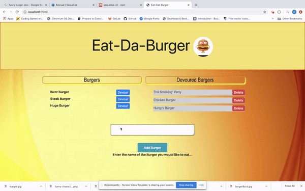
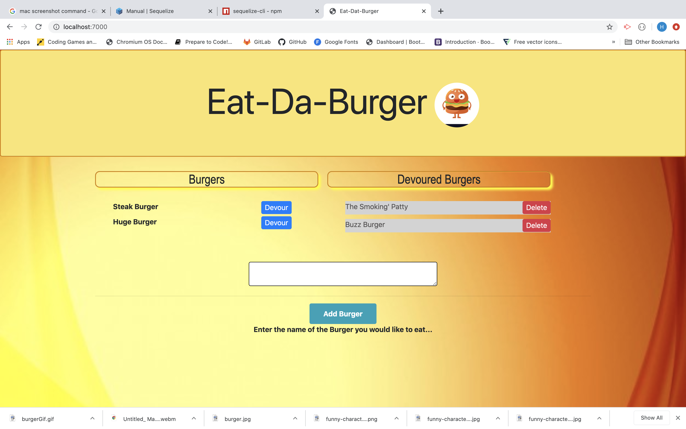

# EAT-DAT-BURGER
 

## Description
 

This is a fun application that allows users to input the Burger they want to eat. Once theyclick on the "Add Burger" button, the burger will be displayed on the screen on the left side under burgers, with a button that says devour... Once they click on the devour button, the burger name will move to the right side under "Devoured Burgers", also with a delete button that they can use to remove eaten burgers... The application is launched using Heroku, and all the data is being saved in MySQL.

## Installation
 

The application can be forked or cloned from GITHUB. The app is luanched in Heroku and can be opened by clicking <a href = "https://stormy-taiga-53566.herokuapp.com/"> here</a>. 

 

## Info

This project we used a npm package called <a href ="https://www.npmjs.com/package/express-handlebars">"express-handlebars"</a>. Handlebars. js is a popular templating engine that is powerful, simple to use and has a large community. It is based on the Mustache template language, but improves it in several important ways. With Handlebars, you can separate the generation of HTML from the rest of your JavaScript and write cleaner code.

 

 Also, we are using object-relational mapper (ORM). <a href = "https://www.js-data.io/docs/what-is-an-orm">ORM</a> is a code library that automates the transfer of data stored in relational databases tables into objects that are more commonly used in application code. 

 

 As far as design we are using an application design model comprised of three interconnected parts called  <a href = "https://en.wikipedia.org/wiki/Model%E2%80%93view%E2%80%93controller">"Model-View-Controller"</a> or MVC. The MVC model or "pattern" is commonly used for developing modern user interfaces. It is provides the fundamental pieces for designing a programs for desktop or mobile, as well as web applications.

## Questions
 
<a href = "mailto:gohucosta23@hotmail.com">gohucosta23@hotmail.com</a> 